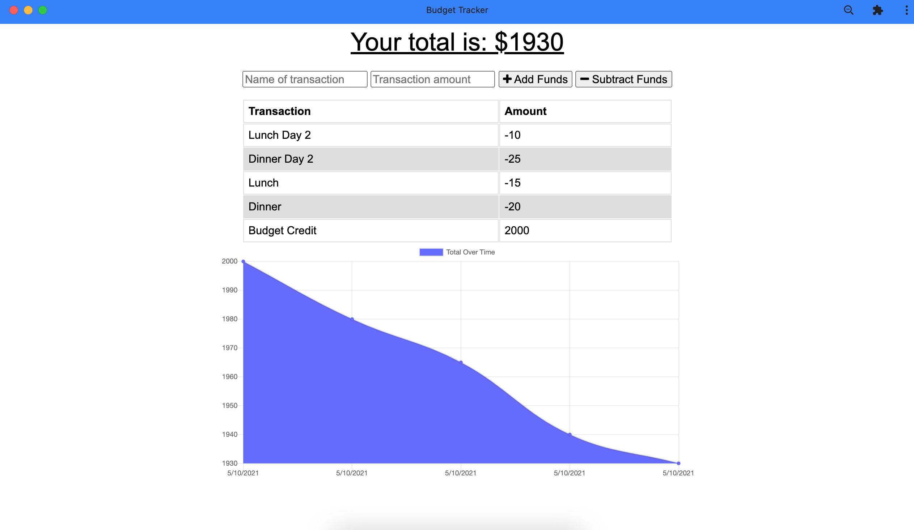

# Budget Tracker READme

## Description

This application is designed to aid users in tracking expenses and deposits to their budget with or without a connection. The application is a PWA and is therefore installable, and populates any offline inputted data when returning to an online status. This is meant to assist in the possibility of not having an internet connection during travel, to give users a fast and easy way to track their budget. 

## Table of Contents
- [Installation](#installation)
- [Usage](#usage)
- [Contribute](##contribute)
- [Contact](##questions?)

## Installation
If choosing to host locally, install the necessary dependencies by running the following command:

    npm i

The application may be added as a PWA by following the directions to install a PWA for your device.
[Click here for further assistance in PWA installation.](https://support.google.com/chrome/answer/9658361?co=GENIE.Platform%3DAndroid&hl=en)

## Usage
This web application is a PWA meant to also be used offline. The add and subtract funds complete the functions they are labelled to do, and users may view the results and a running chart of their budget and expenses on the app.
### Demo

[Click here to view the deployed site.](https://moneywisebud.herokuapp.com/)

---  

## Contribute
Please contact the email below for any contributions or issues.

## Questions?
If you come across any issues with the repo, please open an issue, or contact me directly at: anth8nyc@gmail.com. More of my work is avaiable on GitHub at [anth8nyc](https://github.com/anth8nyc/).

